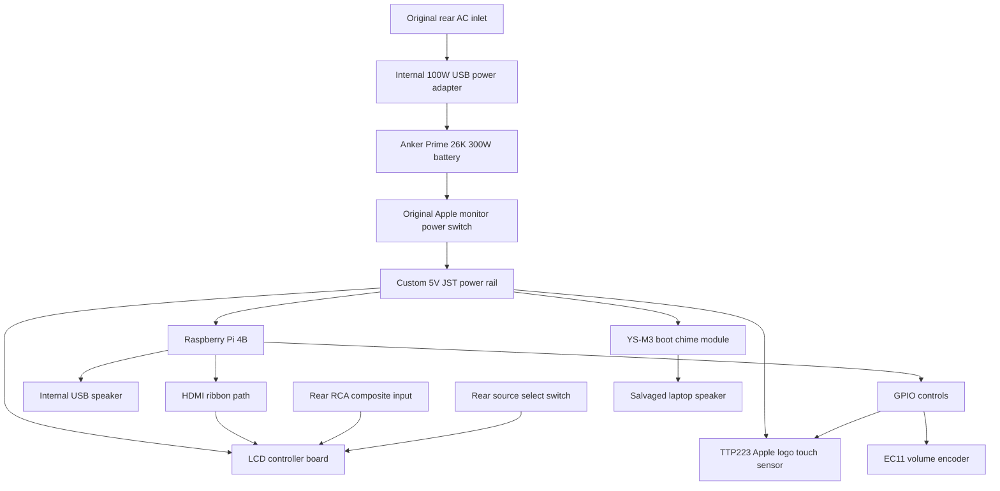

# Macintosh PiForma

**A Raspberry Pi-powered Macintosh Performa fever dream built inside an Apple IIc Monitor.**

Macintosh PiForma is a finished Raspberry Pi 4B build inside a retired Apple IIc Monitor shell. It is not a restoration. It is not pretending to be a museum piece. It is a working, portable, weirdly sincere Apple-flavored machine that lives somewhere between a Macintosh Performa, a Raspberry Pi desktop, a retro game station, and a piece of early-2000s Mac mod forum nostalgia.

The original CRT was already too far gone to justify saving. The case, power switch, AC inlet, rear openings, and overall monitor shape were kept and reused. The inside was rebuilt around a modern LCD, a Raspberry Pi 4B, an Anker battery, a custom 5V JST power rail, a boot chime module, a capacitive Apple logo button, and a Bluetooth-converted Apple ADB keyboard.

It is called **Macintosh PiForma** because puns are allowed here.

## What it does

- Boots a Raspberry Pi desktop with a Mac OS 9-ish look.
- Runs at 800x480 on an internal LCD panel.
- Uses the original Apple monitor power switch to turn the system rail on and off.
- Can charge its internal Anker battery through the original rear AC inlet.
- Can run from battery power.
- Has HDMI from the Raspberry Pi and RCA composite video input through the LCD controller.
- Has a rear source-select switch wired to the LCD controller's source button.
- Has a boot chime selector with multiple startup sounds.
- Uses the front Apple logo as a capacitive multi-tap gesture button.
- Has an internal USB speaker for Raspberry Pi audio.
- Uses a converted Apple ADB keyboard over Bluetooth.
- Uses a matching 3D printed Apple-style wireless mouse.
- Travels in a custom velvet-lined bag with a hidden wireless charging pad.

## Why this exists

I grew up looking at Macintosh mods on places like AppleFritter and other early Mac modding corners of the internet. G3s, G4s, weird translucent plastics, practical hacks, dumb hacks, beautiful hacks. I always wanted to build something that felt like that era.

Macintosh PiForma is not a perfect recreation of anything Apple shipped. It is more like a fever dream of what a portable Macintosh Performa-ish object could have been if it had Raspberry Pi guts, a pile of JST connectors, too many HDMI ribbon cables, and a stubborn refusal to stop being charming.

## Project status

This is documented as a **finished project**.

That does not mean there are no future improvements. It means this version is complete enough to put a bow on it and stop mentally treating it as a pile of loose tasks.

## Photo placeholders

Add final project photos here:

```text
docs/images/front-beauty-shot.jpg
docs/images/rear-panel.jpg
docs/images/interior-open.jpg
docs/images/shelf-assembly.jpg
docs/images/power-rail.jpg
docs/images/display-controller.jpg
docs/images/battery-position.jpg
docs/images/boot-chime-selector.jpg
docs/images/apple-logo-touch-sensor.jpg
docs/images/keyboard-mod.jpg
docs/images/mouse.jpg
docs/images/bag-interior.jpg
docs/images/monitor-stand.jpg
```

## Hardware overview

At a high level:



## Repo layout

```text
/
├── README.md
├── docs/
│   ├── hardware.md
│   ├── software.md
│   ├── wiring.md
│   ├── bom.md
│   ├── printed-parts.md
│   ├── build-log.md
│   ├── maintenance.md
│   ├── known-issues.md
│   ├── safety.md
│   └── images/
├── stl/
│   ├── shelf/
│   ├── bezel/
│   ├── screen-feet/
│   ├── power-rail/
│   ├── battery-plunger/
│   ├── boot-chime-switch/
│   └── monitor-stand/
├── scripts/
├── systemd/
├── config/
└── references/
```

## Major docs

- [Hardware](docs/hardware.md)
- [Software](docs/software.md)
- [Wiring](docs/wiring.md)
- [Bill of Materials](docs/bom.md)
- [Printed Parts](docs/printed-parts.md)
- [Build Log](docs/build-log.md)
- [Maintenance](docs/maintenance.md)
- [Known Issues](docs/known-issues.md)
- [Safety](docs/safety.md)

## Credits

Built by **Matthew Frost**.

The Apple ADB keyboard Bluetooth conversion is based on Matt Chesters' excellent work:

<https://github.com/mattchesters/zmk-apple-desktop-bus-keyboard>

That keyboard work is not my original design. It is included here because the keyboard became part of the complete Macintosh PiForma setup.

## License

Suggested license split:

- Code, scripts, and service files: MIT
- Documentation and printed part notes: CC BY 4.0
- Third-party designs remain under their original licenses

See [LICENSE.md](LICENSE.md).
