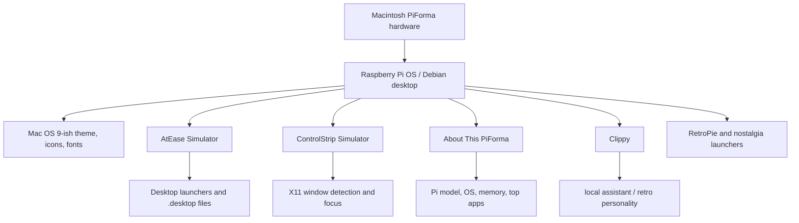

# Related Projects

Macintosh PiForma is the hardware build, but the full experience now spans several companion repos.

This page keeps those pieces tied together so the project does not look like a random pile of separate apps.

## Project map

| Project | Repo | What it is | Role in PiForma |
|---|---|---|---|
| Macintosh PiForma docs | https://github.com/milagrofrost/Macintosh-PiForma-docs | documentation repo | build docs, BOM, wiring, maintenance, photos, STLs |
| AtEase Simulator | https://github.com/milagrofrost/AtEase-simulator | Tauri launcher shell | full-screen At Ease-style app launcher |
| ControlStrip Simulator | https://github.com/milagrofrost/ControlStrip-Simulator | Tauri dock/control strip | Mac OS-style utility strip and app focus helper |
| About This PiForma | https://github.com/milagrofrost/about-this-pi | About This Mac-style app | shows PiForma system info and top-memory apps |
| Clippy | https://github.com/milagrofrost/clippy | forked retro AI assistant | desktop personality layer |

## How they fit together



## AtEase Simulator

Repo:

```text
https://github.com/milagrofrost/AtEase-simulator
```

Role:

- replaces a normal Linux desktop launcher with an At Ease-style shell
- gives PiForma a simple front-end for launching the curated app set
- runs as `atease.service`
- uses `~/.config/atease/config.yaml`
- launches through `.desktop` files instead of arbitrary front-end commands

Why it matters:

AtEase makes the machine feel like something you can hand to a kid, a friend, or your future self without explaining Linux menus.

## ControlStrip Simulator

Repo:

```text
https://github.com/milagrofrost/ControlStrip-Simulator
```

Role:

- frameless transparent dock-style utility strip
- runs under X11
- launches or focuses configured apps
- detects windows through tools like `xdotool`, `xprop`, and `wmctrl`
- runs as a user service under `graphical-session.target`

Why it matters:

It gives the desktop that classic Mac system-extension energy. It is a small detail, but small details are kind of the entire project.

## About This PiForma

Repo:

```text
https://github.com/milagrofrost/about-this-pi
```

Role:

- About This Mac-style window for PiForma
- shows system identity in a way that fits the theme
- turns Raspberry Pi stats into something that feels like classic Mac personality

Why it matters:

This is the app that says, yes, the joke is intentional.

## Clippy

Repo:

```text
https://github.com/milagrofrost/clippy
```

Role:

- forked from Felix Rieseberg's Clippy
- retro assistant experience
- runs from autostart
- not Mac-like, but extremely period-correct in spirit

Why it matters:

It is silly, but PiForma is allowed to be silly. The whole machine lives in a zone where nostalgia, usefulness, and bad ideas overlap.

## What belongs in this docs repo versus app repos

This repo should document integration:

- where apps are installed on the Pi
- how they start
- how they relate to the physical build
- what services launch them
- what configs should be backed up
- what screenshots show them in context

The individual app repos should document development:

- build commands
- source layout
- app-specific config
- packaging and release notes
- screenshots for that app alone

## Suggested cross-linking

Each app repo should link back here with a short sentence like:

```markdown
This app is part of the Macintosh PiForma project:
https://github.com/milagrofrost/Macintosh-PiForma-docs
```

This docs repo should link outward to each app repo, which it now does here.

The goal is simple: nobody should land on one repo and miss the bigger weird beautiful machine it belongs to.
