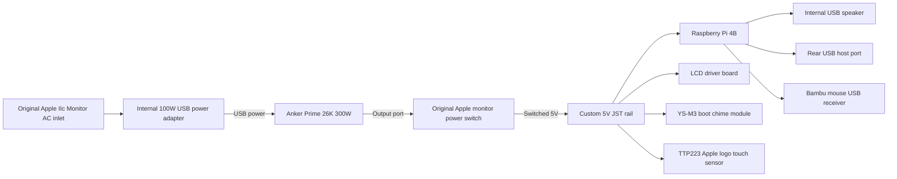
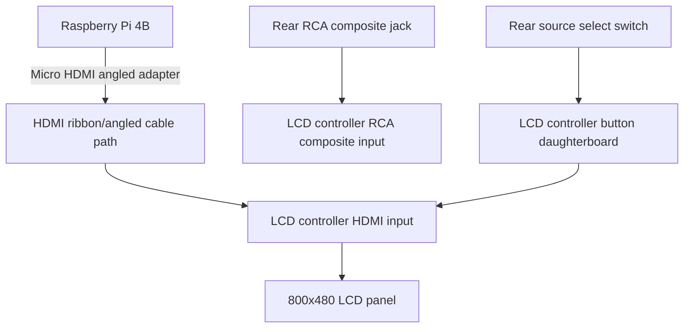
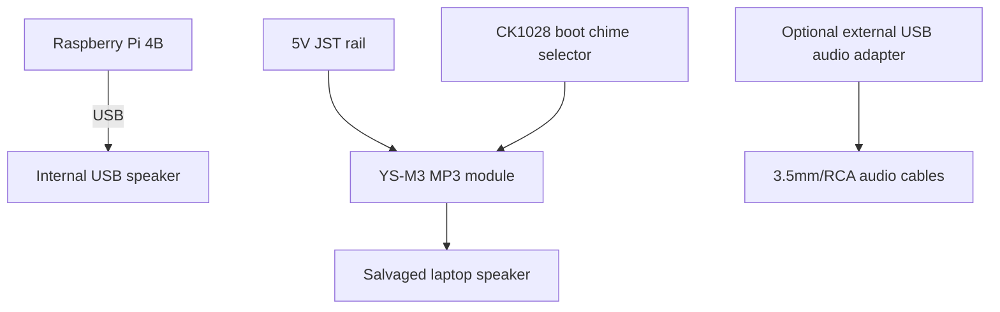
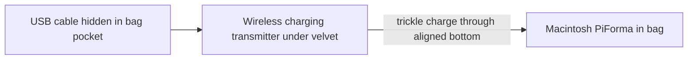

# Wiring

This file documents Macintosh PiForma wiring at a system level. It is not a pin-perfect schematic yet. It is a map for Future Matthew so the machine does not become a mystery box.

## Power diagram



## Charging behavior

The original Apple monitor power switch interrupts battery output to the 5V rail.

It does not interrupt charger input.

Monitor off:

```text
AC inlet -> charger -> Anker battery
Anker output -> interrupted by original Apple switch
5V rail -> off
Pi/display/audio -> off
```

Monitor on:

```text
AC inlet -> charger -> Anker battery
Anker output -> original Apple switch -> 5V rail
Pi/display/chime/touch/display -> on
```

## Anker port usage

| Anker port | Use |
|---|---|
| Port 1 | Input from internal 100W USB power adapter |
| Port 2 | Powers wireless charging transmitter in the bag |
| Port 3 | Output to original power switch, then custom 5V rail |

Exact physical port numbering may vary. The function matters more than the label.

## Custom 5V JST rail

Construction:

```text
through-hole perfboard
  + small 2-pin JST connectors in a row
  + stripped solid-core wire as positive bus
  + stripped solid-core wire as ground bus
  + soldered underside
  + 3D printed enclosure
```

Approximate outputs:

```text
6 JST outputs
```

Current loads:

| Load | Powered by rail? | Notes |
|---|---:|---|
| Raspberry Pi 4B | yes | main compute board |
| LCD controller | yes | final display controller |
| YS-M3 boot chime module | yes | plays startup sounds |
| TTP223 Apple logo touch sensor | yes | GPIO 23 signal to Pi |
| USB speaker | no | powered by Raspberry Pi USB |
| Relays | no | relay idea abandoned in final build |

## GPIO mapping

| Function | GPIO | Notes |
|---|---:|---|
| Apple logo touch sensor | GPIO 23 | active-low, multi-tap and hold gestures |
| Volume encoder A | GPIO 17 | EC11 rotary encoder |
| Volume encoder B | GPIO 27 | EC11 rotary encoder |
| Volume encoder push | GPIO 22 | software supports mute, physical push not usable |

## Video diagram



## Display source select

The LCD controller has a button/IR daughterboard. The IR function is unused.

The source button was soldered to external wires and routed to a rear physical switch.

Pressing the switch cycles:

```text
HDMI -> RCA -> VGA -> RCA2 -> repeat
```

Only HDMI and RCA are currently useful.

## Audio diagram



## Boot chime selector

The CK1028 switch selects the YS-M3 startup sound.

Expected behavior:

1. Original monitor power switch turns on the 5V rail.
2. YS-M3 receives power.
3. After roughly two seconds, YS-M3 plays the selected startup sound.
4. The selected sound comes out of the dedicated salvaged laptop speaker.

## Rear ports and controls

| Rear item | Function |
|---|---|
| Original AC inlet | Charger input to internal USB power adapter |
| Original power switch | Interrupts battery output to 5V rail |
| RCA jack | Composite video input |
| USB port | Raspberry Pi USB host extension for hub/controllers |
| Source select switch | Cycles LCD controller input |
| Boot chime selector | Selects startup sound |
| Battery plunger | Presses Anker battery button from outside case |

## Bag charging diagram



The bag wireless charger is meant for trickle charging the Macintosh PiForma while it is sitting in the bag. It is not a fast-charge system.
